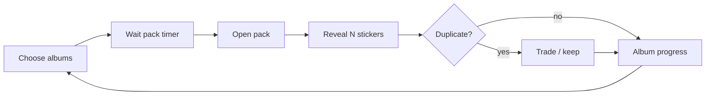

# Product — Stickera

> **SDD:** esta é a spec de produto. Processo: [SDD-DEVELOPMENT.md](SDD-DEVELOPMENT.md). Validação: [SPEC-VALIDATION.md](SPEC-VALIDATION.md).

## Vision

A nostalgic **sticker album** experience on mobile: collect figurinhas from themed albums, open timed packs, complete sets, and trade duplicates with other players — **free**, **offline-capable**, with content you publish from your repo/hosting.

Secondary goal: **portfolio MVP** showcasing mobile architecture, atomic UI, i18n, and static content pipelines — with clear **professional signature** (name, links, optional logo).

## Target users

- Casual collectors (no account required)
- Friends trading duplicates in person or via share sheet

## Core loops



## MVP scope (v1)

### In scope

| Area | Behavior |
|------|----------|
| Album catalog | User enables which albums to pull from; metadata from static manifest |
| Pack timer | One pack per interval; `hours` / `minutes` / `seconds` from config |
| Pack open | Draw **N** stickers without replacement from enabled albums’ pools |
| Collection | Per-sticker quantity; mark “new” on first obtain |
| Duplicates | Quantity &gt; 1 enables trade offers |
| P2P trade | QR or share payload; confirm on device — see TRADING-P2P |
| Content sync | Check remote manifest version; download missing assets |
| i18n | EN default + `pt-BR` (or user’s second locale) structure ready |
| Signature | About screen: photo/name, role, GitHub/LinkedIn, “made with …” |

### Out of scope (later)

- Accounts, cloud save, anti-cheat
- Push notifications (optional later via Expo)
- In-app purchases
- Global leaderboard / matchmaking server
- Real-time online trading

## Configurable parameters (single `app-config.json` or remote manifest)

```json
{
  "packCooldown": { "value": 4, "unit": "hours" },
  "stickersPerPack": 5,
  "tradeRequiresConfirmation": true,
  "signature": {
    "authorName": "Your Name",
    "taglineKey": "about.tagline",
    "links": { "github": "https://github.com/...", "linkedin": "..." }
  }
}
```

Album-level overrides allowed (e.g. rarer album only in packs if `weight` set).

## Acceptance criteria (MVP done)

1. Installable build (EAS or local) on Android and iOS simulator/device.
2. First launch: bundled album playable offline.
3. After cooldown, user opens pack and sees N new stickers (no duplicate within same pack).
4. Duplicate count updates; user can initiate trade and another device can accept via QR/share.
5. Pulling newer manifest from Netlify updates album list without app store release (OTA optional for JS only).
6. UI strings switch between EN and PT via settings.
7. About screen shows portfolio signature.

## Non-goals (explicit)

- Preventing save-file editing
- Guaranteed trade fairness across strangers worldwide (trust local confirm UX)

## Glossary

| Term | Meaning |
|------|---------|
| Album | Themed set (e.g. “Space”, “Retro Games”) |
| Sticker / figurinha | One collectible card in an album |
| Pack | Timed drop of N random stickers |
| Duplicate | Sticker with owned quantity ≥ 2 |
