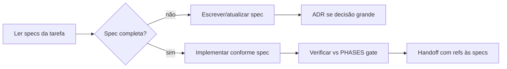

# Spec Driven Development (SDD) — Stickera

Metodologia oficial do projeto: **a especificação é a fonte de verdade**; código e conteúdo são implementações que devem conformar-se às specs já escritas.

Este repositório **não usa MCP** (Model Context Protocol) como parte do produto nem da metodologia.

---

## 1. Princípios SDD

| # | Princípio | No Stickera |
|---|-----------|-------------|
| 1 | **Spec first** | Alterar `docs/*.md` ou `docs/schemas/*.json` *antes* de codar |
| 2 | **Spec as contract** | PRODUCT, DATA-MODEL, TRADING-P2P, schemas = contrato |
| 3 | **Traceability** | Toda feature mapeia para fase em `PHASES/` + item em `MVP-CHECKLIST` |
| 4 | **No spec drift** | Código contradiz spec → corrigir código ou atualizar spec + ADR |
| 5 | **Review against spec** | “Pronto” = checklist da fase + conformidade com schemas |
| 6 | **Incremental specs** | Uma unidade por sessão: um álbum, uma feature, um organismo |

---

## 2. Hierarquia de especificações

Ordem de precedência (a mais alta vence em conflito):

```
1. Pedido explícito do usuário (conversa atual)
2. docs/PRODUCT.md                    — requisitos e MVP
3. docs/decisions/*.md (ADR aceitos)    — decisões irreversíveis
4. docs/ARCHITECTURE.md + DATA-MODEL  — estrutura e dados
5. docs/schemas/*.json                — contratos JSON machine-readable
6. docs/{DOMAIN}.md                   — TRADING-P2P, I18N, CONTENT-SYNC, ATOMIC-DESIGN
7. docs/PHASES/NN-*.md               — critérios de saída por fase
8. docs/CODING-STANDARDS + FILE-TEMPLATES — como implementar
9. Código existente (se spec silenciosa, seguir padrão do código + CODING-STANDARDS)
```

---

## 3. Tipos de spec no repo

| Tipo | Local | Quando atualizar |
|------|-------|------------------|
| **Produto** | PRODUCT.md | Nova regra de negócio, escopo MVP |
| **Arquitetura** | ARCHITECTURE.md | Nova camada, rota, lib |
| **Dados** | DATA-MODEL.md, schemas/ | Campo DB, payload trade, manifest |
| **Comportamento** | TRADING-P2P.md, I18N.md, etc. | Fluxo ou convenção |
| **Fase** | PHASES/NN-*.md | Gate de entrega da etapa |
| **Decisão** | decisions/NNN-*.md | Mudança de stack ou contrato |
| **Implementação** | CODING-STANDARDS, FILE-TEMPLATES | Padrão de código |

**Regra:** se o comportamento mudou e só o código mudou → *spec drift* → proibido merge/conclusão.

---

## 4. Fluxo SDD por sessão

Detalhe operacional: [SESSION-PROTOCOL.md](SESSION-PROTOCOL.md).



### 4.1 Antes de codar

1. `AGENTS.md` → identificar specs relevantes (tabela tarefa→doc).
2. `docs/PHASES/NN-*.md` → fase atual e checklist de saída.
3. Se tocar JSON: `docs/schemas/` + exemplos em DATA-MODEL / CONTENT-SYNC.
4. Skill Cursor adequada (ver [CURSOR-GOVERNANCE.md](CURSOR-GOVERNANCE.md)).

### 4.2 Durante

- Uma **spec unit** por sessão (ex.: “Fase 4 pack draw” = DATA-MODEL + PHASES/04 + schema se houver).
- Ordem de implementação fixa: `domain` → `services` → `features` → `components` → `app/` (ARCHITECTURE).

### 4.3 Depois

- Marcar itens do MVP-CHECKLIST **somente** se usuário pedir commit de progresso.
- Handoff cita **quais specs** foram satisfeitas (não só “feito”).

---

## 5. SDD por fase MVP

| Fase | Specs primárias | Gate = |
|------|-----------------|--------|
| 0 | DEVELOPMENT-STANDARDS, CURSOR-GOVERNANCE, PHASES/00 | Governança completa |
| 1 | ARCHITECTURE, ATOMIC-DESIGN, I18N, PHASES/01 | Expo + átomos + locales |
| 2 | DATA-MODEL, schemas, CONTENT-SYNC, PHASES/02 | localStorage + sync |
| 3 | ATOMIC-DESIGN, PHASES/03 | UI coleção |
| 4 | PRODUCT, DATA-MODEL, PHASES/04, TESTING | Pack + testes domain |
| 5 | TRADING-P2P, trade-payload.schema, PHASES/05 | Trade P2P |
| 6 | PRODUCT signature, PHASES/06 | Release portfolio |

Índice: [PHASES/README.md](PHASES/README.md).

---

## 6. Validação de conformidade (sem MCP)

Conformidade = checklist manual ou script opcional contra spec.

| Verificação | Spec de referência | Como validar |
|-------------|-------------------|--------------|
| Manifest álbum | album.schema.json, CONTENT-SYNC | [SPEC-VALIDATION.md](SPEC-VALIDATION.md) §1 |
| Catálogo | catalog.schema.json | SPEC-VALIDATION §1 |
| i18n | I18N.md | SPEC-VALIDATION §2 |
| Estrutura pastas | ARCHITECTURE, PHASES | SPEC-VALIDATION §3 |
| Trade payload | trade-payload.schema.json | SPEC-VALIDATION §4 |
| Domain pack/trade | DATA-MODEL, TESTING | testes Jest + SPEC-VALIDATION §5 |

Scripts em `scripts/` (se existirem) são **auxiliares opcionais** — não fazem parte da metodologia SDD obrigatória.

---

## 7. Spec drift — exemplos proibidos

| Drift | Correção |
|-------|----------|
| `stickersPerPack = 5` hardcoded | Ler de `app-config.json`; spec em PRODUCT |
| Trade sem `TradeAck` | Implementar TRADING-P2P ou revisar spec + ADR |
| Novo campo no localStorage não em DATA-MODEL | Atualizar DATA-MODEL primeiro |
| UI string sem chave i18n | I18N.md — en + pt |
| Componente fora do tier atomic | ATOMIC-DESIGN |

---

## 8. ADR (decisions)

Mudança que altera contrato ou stack:

1. Copiar `docs/decisions/000-template.md` → `NNN-titulo.md`
2. Status `accepted`
3. Atualizar ARCHITECTURE / DATA-MODEL / schemas afetados
4. Só então implementar

---

## 9. Relação com Cursor (rules / skills / .cursorrules)

Cursor **não é** SDD — é enforcement do agente:

- `.cursorrules` — resumo global
- `.cursor/rules/*.mdc` — lembretes por tipo de arquivo
- `.cursor/skills/*` — fluxos spec-first por tarefa

Mapa: [CURSOR-GOVERNANCE.md](CURSOR-GOVERNANCE.md).

---

## 10. O que este repo NÃO inclui

- Servidor MCP, `.cursor/mcp.json`, integração Model Context Protocol
- Backend de aplicativo
- Implementação de app até pedido explícito do usuário

---

**Versão SDD:** 1.0 | Substitui qualquer doc anterior nomeada “MCP-DEVELOPMENT”.
