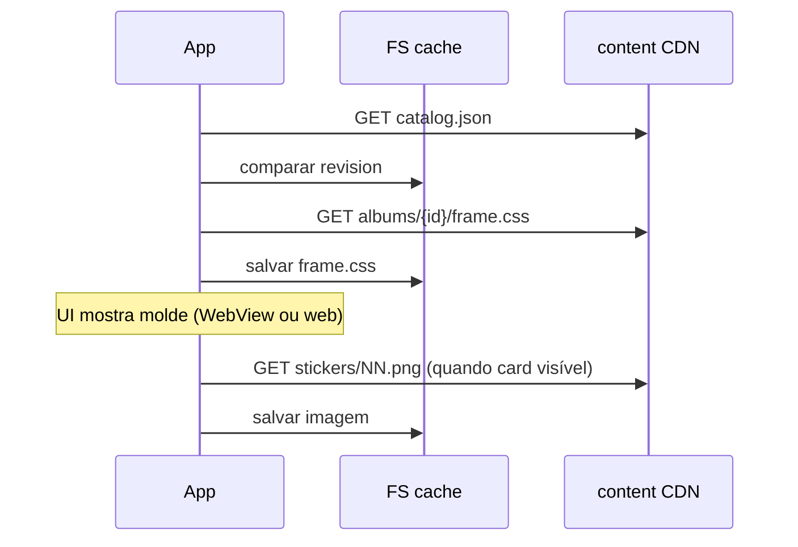

# Sticker frames — CSS por álbum + arte lazy

> **SDD:** spec de apresentação das figurinhas. Validação: [SPEC-VALIDATION.md](SPEC-VALIDATION.md) §1. Sync: [CONTENT-SYNC.md](CONTENT-SYNC.md).

## Conceito

Cada álbum define um **molde visual** (`frame.css`) — a “caixa” da figurinha. A **arte** é um arquivo de imagem (`.png`, `.jpg`, `.jpeg`, `.gif`) colocado **sobre** esse molde, no mesmo padrão HTML/CSS.

```
┌─────────────────────┐
│  .sticker-frame     │  ← frame.css (borda, fundo, sombra, proporção)
│  ┌───────────────┐  │
│  │ .sticker-art  │  │  ← imagem do sticker (lazy load)
│  └───────────────┘  │
└─────────────────────┘
```

Um álbum = um `frame.css` distinto. Outro álbum pode ter bordas douradas, outro pixel art, etc.

## Estrutura no repositório (`content/`)

Publicado no GitHub/Netlify; o app sincroniza para o armazenamento local do dispositivo.

```
content/
  catalog.json
  app-config.json
  albums/
    {album-id}/
      album.json          # manifest + frameStylePath
      frame.css           # obrigatório — estilos do molde
      stickers/           # artes (opcional até você subir)
        01.png
        02.jpg
      cover.webp          # opcional
```

| Arquivo | Obrigatório | Função |
|---------|-------------|--------|
| `album.json` | sim | Metadados, lista de stickers, `frameStylePath` |
| `frame.css` | sim | Estilos do molde deste álbum |
| `stickers/*.{png,jpg,jpeg,gif}` | por sticker | Arte; validada só se `image` no manifest |

## Contrato `frame.css`

Classes **obrigatórias** (o runtime injeta HTML com esses nomes):

| Classe | Elemento | Papel |
|--------|----------|--------|
| `.sticker-frame` | `div` | Caixa / moldura (tamanho, borda, fundo, `border-radius`) |
| `.sticker-art` | `img` | Arte; `object-fit`, margens internas, opcional `filter` |

### Modificadores de raridade e bloqueio (obrigatório no template)

Copiar de [`content/templates/rarity-modifiers.css`](../content/templates/rarity-modifiers.css) no final de cada `frame.css`. O app injeta as classes no `div.sticker-frame` conforme `sticker.rarity` e posse (`quantity > 0`).

| Classe | Quando | Efeito |
|--------|--------|--------|
| `.sticker-frame--common` | `rarity: common` | Borda `#8B9199` |
| `.sticker-frame--uncommon` | `rarity: uncommon` | Borda `#3D8B6E` + glow leve |
| `.sticker-frame--rare` | `rarity: rare` | Borda `#2A6B7D` + glow |
| `.sticker-frame--legendary` | `rarity: legendary` | Borda `#F4B942` + glow dourado |
| `.sticker-frame--locked` | `quantity === 0` | Opacidade baixa + grayscale na moldura e arte |

Cores alinhadas a `src/theme/rarity.ts` (`RARITY_TONES`: fill, border, icon) e ao atom `RarityMedalIcon` — medalha em círculo preenchido acima do contador ×N à direita da moldura.

### Exemplo mínimo

```css
.sticker-frame {
  width: 120px;
  height: 160px;
  box-sizing: border-box;
  border: 3px solid #1b4d5c;
  border-radius: 12px;
  background: linear-gradient(180deg, #f7f3ed 0%, #ede8df 100%);
  display: flex;
  align-items: center;
  justify-content: center;
  overflow: hidden;
}

.sticker-art {
  width: 92%;
  height: 92%;
  object-fit: contain;
  border-radius: 6px;
}
```

## `album.json` — campos de frame

```json
{
  "id": "retro-games",
  "revision": 1,
  "frameStylePath": "frame.css",
  "totalStickers": 12,
  "nameKey": "albums.retroGames.name",
  "stickers": [
    {
      "id": "retro-games:01",
      "number": 1,
      "nameKey": "albums.retroGames.stickers.01.name",
      "image": "stickers/01.png"
    }
  ]
}
```

- `frameStylePath`: relativo à pasta do álbum; padrão `frame.css`.
- `image`: caminho relativo; extensões permitidas: `png`, `jpg`, `jpeg`, `gif` (minúsculas no repo).

**Entrega só CSS:** `stickers[]` pode ser `[]` — o álbum ainda precisa de `frame.css` para preview do molde.

## Fluxo no dispositivo (lazy async)



| Recurso | Quando carrega | Onde cacheia |
|---------|----------------|--------------|
| `frame.css` | Ao abrir álbum ou ao exibir preview | `{contentCache}/albums/{id}/frame.css` |
| Arte `stickers/*` | Lazy: sticker entra na viewport | `{contentCache}/albums/{id}/stickers/NN.ext` |

Fase 1 (este entregável): estrutura + `frame.css` no repo + loader/preview no app.  
Fase 2: sync completo + cache SQLite de metadados.

## Runtime (app)

- **Preview / render:** `WebView` com HTML mínimo + CSS injetado + `img.sticker-art` quando houver URI da arte.
- **Native futuro (opcional):** parser CSS→RN fora do escopo MVP; até lá WebView é a spec.

Serviço: `src/services/content/AlbumFrameStyleLoader.ts` — `loadFrameCss(albumId): Promise<string>` com cache em memória + `expo-file-system`.

## Authoring (você no repo)

1. Criar `content/albums/{novo-album}/`.
2. Escrever `frame.css` (molde).
3. Opcional: adicionar imagens em `stickers/`.
4. Atualizar `album.json` e registrar em `catalog.json`; bump `revision` e `catalog.version`.
5. Push → Netlify → app sincroniza.

## Anti-padrões

- Estilos de moldura hardcoded no app por álbum (deve vir de `frame.css`).
- Um único CSS global para todos os álbuns (quebra identidade por álbum).
- Arte embutida em CSS como `background-url` fixa (arte deve ser arquivo separado para lazy load).
