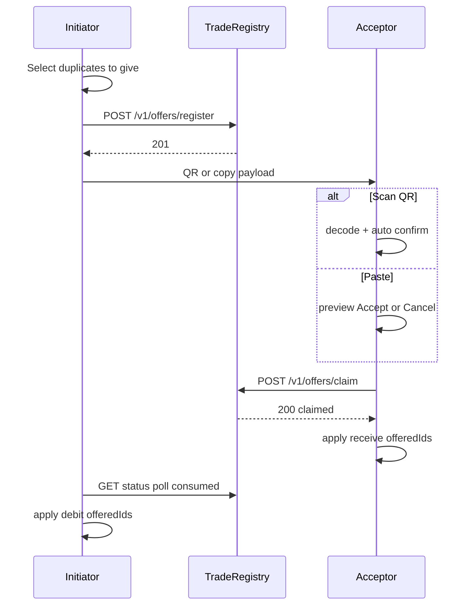

# P2P trading (gift model + trade registry)

> **SDD:** spec de trade P2P. Schemas: [trade-payload.schema.json](schemas/trade-payload.schema.json), [trade-ack.schema.json](schemas/trade-ack.schema.json) (legado). Validação: [SPEC-VALIDATION.md](SPEC-VALIDATION.md) §4. Phase 5: [PHASES/05-trading.md](PHASES/05-trading.md). Registry: ADR-002.

Trading is **opt-in**, **trust-based**, and **duplicate-only** for offers. Payloads move via QR, copy/paste, or deep link. **Collection changes stay on device**; a minimal **trade registry** (Cloudflare Worker) is **required** to register and claim `offerId` globally.

## Goals

- User A selects duplicate stickers they **give** (no counter-offer in the app).
- User B receives those stickers after claim; reciprocal trades happen outside the app (trust).
- Two hub actions: **Create offer** | **Accept offer** (buttons at top of Trade tab).
- **Paste:** preview → Accept or Cancel (local only until Accept).
- **Scan QR:** preview + **auto-accept** (no Confirm button).
- Initiator debits `offeredIds` when registry reports `consumed` (poll); no manual ack paste.

## Trade payload

JSON → base64url for QR / deep link. **New offers use v2.** v1 remains decodable for legacy log entries only.

### v2 (current)

```typescript
type TradePayloadV2 = {
  v: 2;
  offerId: string;
  fromDisplayName?: string;
  offeredIds: string[]; // 1..100, unique — what initiator gives
  expiresAt: string; // ISO, +5 min default
  fromProfileId?: string;
  contentVersion: string; // must match acceptor catalog
};
```

### v1 (legacy)

Decodable for old `trade_log` rows. New accept flow rejects v1 with a clear error — ask partner for a new v2 code.

## Trade acknowledgment (legacy)

`TradeAck` v1/v2 schemas remain for **historical** `trade_log` entries only. **Active flow does not generate or paste ack.**

## Flow (v2 gift + registry)



## Validation

| Role | Rule |
|------|------|
| Initiator (create) | Each `offeredIds`: `quantity >= 2`; IDs in enabled catalog; not expired |
| Acceptor (gift accept) | Offer not expired; `contentVersion` match; offered IDs in catalog; **no** duplicate check on acceptor inventory |

```typescript
function validateInitiatorOfferIds(offeredIds, collection, catalogIds, expiresAt): ValidationResult;
function validateGiftAccept(payload, catalogIds, localContentVersion): ValidationResult;
```

```typescript
function applyGiftAsAcceptor(collection, offeredIds): Collection; // receive only
function applyGiftAsInitiator(collection, offeredIds): Collection; // debit offered only
```

## UX surfaces

| Screen | Components |
|--------|------------|
| Trade hub | Top: **Create offer** + **Accept offer**; disclaimer; accept panel; sent offers (poll); history |
| Create offer | `TradeStickerSelectGrid`; generate button **above** grid; QR/copy after register |
| Accept | `TradeBundlePreview` (partner gives); Paste/Scan; paste → Accept/Cancel |

**QR display:** when `offeredIds.length <= 8`; else copy payload.

**QR scanner (web/PWA):** `TradeQrScanner`; scan auto-confirms after decode.

## Deep link

`/(tabs)/trade?p=<base64url>` (legacy `stickera://trade/accept?p=` redirects)

## Abuse / expectations

- Trades are between people you trust.
- Editing local saves is possible; not a competitive game.

### Re-copy payload

- Initiator: `trade_log` `sent` — **Copy payload again** while not expired/consumed.

### Anti-replay

- **Registry (required):** one global `claim` per `offerId`.
- **Local:** `consumed_trade_offers`; `OFFER_ALREADY_USED`, `OWN_OFFER`.

### Trade registry (required — ADR-002)

[`workers/trade-registry/README.md`](../workers/trade-registry/README.md)

| Env | `EXPO_PUBLIC_TRADE_REGISTRY_URL` (build-time, required for trade) |
| Client | [`TradeRegistryClient`](../src/services/trade/TradeRegistryClient.ts) |

| Step | Who | Action |
|------|-----|--------|
| Create offer | Initiator | `POST /v1/offers/register` — **must succeed** before showing code |
| Preview | Acceptor | `GET /v1/offers/:id` — block if `consumed` / `expired` |
| Accept | Acceptor | `POST /v1/offers/claim` — **must succeed** before applying collection |
| Complete initiator | Initiator | Poll `GET` until `consumed`, then debit locally |

If registry URL unset or unreachable → trade UI blocked with error (no offline trade).

## In-app UI (Trade tab)

Single hub: **Create offer** | **Accept offer** at top; accept panel toggled by Accept; sent offers with sync poll; collapsible completed history. No ack paste section.

## Future (out of MVP)

- Async negotiation / edit offer
- Bluetooth proximity
- Native camera scanner (non-web builds)
