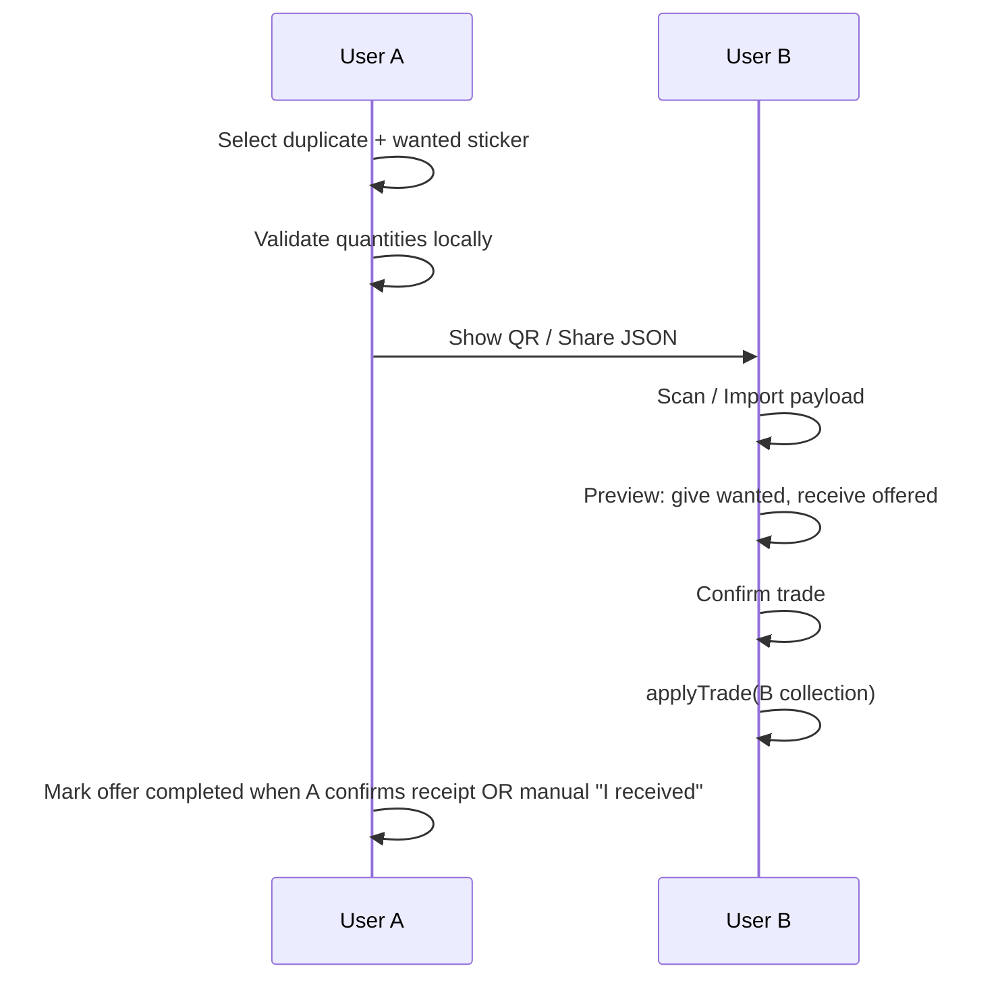

# P2P trading (no backend)

> **SDD:** spec de trade P2P. Schema: [schemas/trade-payload.schema.json](schemas/trade-payload.schema.json). Validação: [SPEC-VALIDATION.md](SPEC-VALIDATION.md) §4. Phase 5: [PHASES/05-trading.md](PHASES/05-trading.md).

Trading is **opt-in**, **local-trust**, and **duplicate-only**. No server mediates; payloads move via QR or OS share sheet.

## Goals

- User A offers sticker X (duplicate) wants sticker Y from enabled albums
- User B scans QR or opens deep link / pastes payload
- Both confirm on device; localStorage updated independently

## Trade payload (v1)

JSON → gzip optional → base64url for QR size limits.

```typescript
type TradePayload = {
  v: 1;
  offerId: string;
  fromDisplayName?: string;
  offered: { stickerId: string; quantity: 1 };
  wanted: { stickerId: string; quantity: 1 };
  expiresAt: string; // ISO, +15 min default
};
```

## Flow



### Asymmetry without server

Without a backend, **both devices must apply the swap**. Options for MVP:

1. **Two-step confirm (recommended)**  
   - B scans and confirms → B’s DB updates immediately.  
   - A gets local notification / Trade Log entry “pending partner”; A taps **Confirm incoming trade** and enters same `offerId` OR scans B’s acknowledgment QR (second payload `TradeAck`).

2. **Single-device honor (simpler, weaker)**  
   - Only initiator’s duplicate is “locked” in draft; acceptor applies; initiator manually confirms. Good enough for friends + MVP disclaimer.

Implement **(1)** with `TradeAck` payload:

```typescript
type TradeAck = { v: 1; offerId: string; acceptedAt: string };
```

## Validation (by role)

```typescript
function validateOfferAsInitiator(payload, collection, catalogIds): ValidationResult;
// - offered sticker quantity >= 2 (duplicate to trade away)
// - wanted in catalog; not expired

function validateOfferAsAcceptor(payload, collection, catalogIds): ValidationResult;
// - wanted sticker quantity >= 1 (acceptor gives wanted)
// - offered in catalog; not expired
```

```typescript
function applyTrade(
  collection: Collection,
  payload: TradePayload,
  role: 'initiator' | 'acceptor'
): Collection;
```

## UX surfaces

| Screen | Organism |
|--------|----------|
| Trade hub | `TradeHub` — list tradable duplicates |
| Create offer | `TradeOfferForm` + QR `TradeQrDisplay` |
| Accept | `TradeScanner` + `TradePreview` |

## Deep link

`stickera://trade/accept?p=<base64url>`

Expo Router route parses `p`, navigates to confirm screen.

## Abuse / expectations

Copy for About / Trade screens (i18n):

- Trades are between people you trust.
- Editing local saves is possible; not a competitive game.

## Future (out of MVP)

- Bluetooth proximity (expo-nearby-connections)
- Encrypted payloads with shared short code
