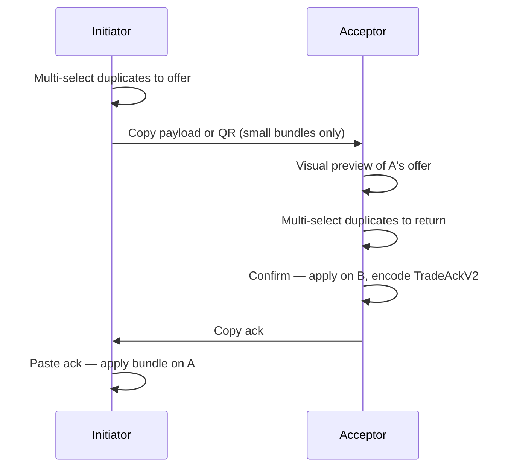

# P2P trading (no backend)

> **SDD:** spec de trade P2P. Schemas: [trade-payload.schema.json](schemas/trade-payload.schema.json), [trade-ack.schema.json](schemas/trade-ack.schema.json). Validação: [SPEC-VALIDATION.md](SPEC-VALIDATION.md) §4. Phase 5: [PHASES/05-trading.md](PHASES/05-trading.md).

Trading is **opt-in**, **local-trust**, and **duplicate-only**. No server mediates; payloads move via QR, copy/paste, or OS share.

## Goals

- User A offers one or more duplicate stickers from enabled albums (no `wanted` in the offer — in-person counter-offer on accept)
- User B imports payload, previews visually, selects duplicates to return
- Both confirm on device; localStorage updated independently via `TradeAck`

## Trade payload

JSON → base64url for QR / deep link. **New offers use v2.** v1 remains decodable for legacy offers.

### v2 (current)

```typescript
type TradePayloadV2 = {
  v: 2;
  offerId: string;
  fromDisplayName?: string;
  offeredIds: string[]; // 1..100, unique
  expiresAt: string; // ISO, +5 min default
  fromProfileId?: string; // device profile stamp for pack-bank bonus
  contentVersion: string; // catalog.version on offer device — must match acceptor
};
```

### v1 (legacy 1:1)

```typescript
type TradePayloadV1 = {
  v: 1;
  offerId: string;
  fromDisplayName?: string;
  offered: { stickerId: string; quantity: 1 };
  wanted: { stickerId: string; quantity: 1 };
  expiresAt: string;
};
```

## Trade acknowledgment

```typescript
type TradeAckV2 = {
  v: 2;
  offerId: string;
  acceptedAt: string;
  acceptorIds: string[]; // 1..100, what acceptor gave
  acceptorProfileId?: string;
};

type TradeAckV1 = { v: 1; offerId: string; acceptedAt: string };
```

Initiator confirms by pasting **v2 ack** (includes `acceptorIds`) so their collection applies the bundle.

## Flow (v2, in-person)



## Validation

| Role | Rule |
|------|------|
| Initiator (create) | Each `offeredIds` entry: `quantity >= 2`; IDs in enabled catalog; not expired |
| Acceptor (confirm) | Each `acceptorIds` entry: `quantity >= 2`; offer not expired; IDs in catalog |

```typescript
function validateInitiatorOfferIds(offeredIds, collection, catalogIds, expiresAt): ValidationResult;
function validateAcceptorCounterIds(payload, acceptorIds, collection, catalogIds): ValidationResult;
```

```typescript
function applyTradeBundle(collection, giveIds, receiveIds): Collection;
// initiator: give offeredIds, receive acceptorIds
// acceptor: give acceptorIds, receive offeredIds
```

## UX surfaces

| Screen | Components |
|--------|------------|
| Trade hub | Pending sent + ack confirm |
| Create offer | `TradeStickerSelectGrid` — offer only |
| Accept | `TradeBundlePreview` (partner) + grid (counter-offer); **QR scanner** (web) or paste |
| Trade hub | `TradeBundlePreview` on pending sent/imported offers |

**QR display:** recommended when `offeredIds.length <= 8`; larger bundles — copy payload (QR/deep link may fail).

**QR scanner (accept screen, web/PWA):** `TradeQrScanner` uses `html5-qrcode` + camera permission. Toggle **Paste** / **Scan**; decoded token fills the same field as manual paste. If `getUserMedia` is unavailable (some desktops), user stays on paste. Deep link `?p=` still works without camera.

## Deep link

`stickera://trade/accept?p=<base64url>`

## Abuse / expectations

- Trades are between people you trust.
- Editing local saves is possible; not a competitive game.

### Re-copy tokens (local)

- Initiator: `trade_log` stores `encoded_payload` for `status: sent` — hub **Copy payload again**.
- Acceptor: on paste/decode, offer saved as `draft` with payload — copy or **Continue** before confirm.
- After accept/confirm: `ack_encoded` stored — **Copy ack again** from hub/recent.

### Anti-replay (this device only)

- `consumed_trade_offers` in settings: `offerId` marked when a trade **completes** on this device (accept or initiator confirm).
- Importing a consumed `offerId` → `OFFER_ALREADY_USED`.
- Accepting your own sent offer → `OWN_OFFER`.

**Without registry**, the same payload can still be pasted on **another person's phone** until expiry.

### Optional global registry (ADR-002)

Cloudflare Worker: [`workers/trade-registry/README.md`](../workers/trade-registry/README.md).

| Env | `EXPO_PUBLIC_TRADE_REGISTRY_URL` (build-time) |
| Client | [`TradeRegistryClient`](../src/services/trade/TradeRegistryClient.ts) |

| Step | Who | Action |
|------|-----|--------|
| Create offer | Initiator | `POST /v1/offers/register` (best-effort; offline still works) |
| Preview paste | Acceptor | `GET /v1/offers/:id` — block if `consumed` / `expired` |
| Confirm | Acceptor | `POST /v1/offers/claim` — atomic global single accept |

If registry URL unset or unreachable → local-only flow (no block on register miss; claim `unavailable` skips).

## Future (out of MVP)

- Async negotiation / edit offer
- Bluetooth proximity
- Native camera scanner (non-web builds)
